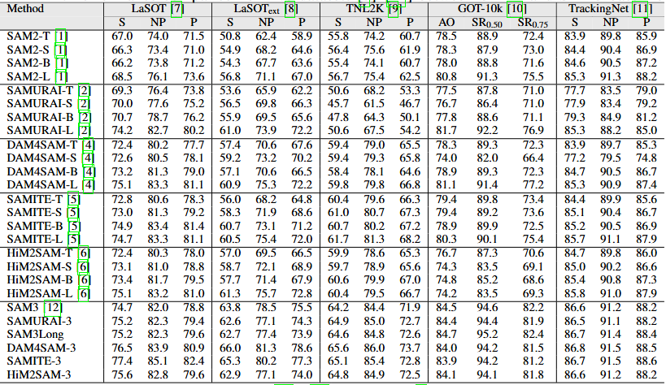

<div align="center">

# SAM3 Tracking Zoo

**A unified benchmark and re-implementation of SAM2-era trackers on SAM3**

[]()
[](LICENSE)
[]()

</div>

SAM3 Tracking Zoo is a unified benchmark and codebase for adapting SAM2-era
tracking methods to the SAM3 backbone, providing consistent implementations,
standardized inference, and fair evaluation across multiple benchmarks.

## Repository Structure

```text
baseline/        - SAM3 baseline tracker
DAM4SAM-3/       - DAM4SAM adapted to SAM3
SAMURAI-3/       - SAMURAI adapted to SAM3
HiM2SAM-3/       - HiM2SAM adapted to SAM3
SAMITE-3/        - SAMITE adapted to SAM3
SAM3Long/        - SAM2Long adapted to SAM3


Each directory contains:
- Model implementation
- Inference scripts for all supported datasets

# Included Trackers (SAM2 → SAM3 Adaptations)
| Tracker       | Origin (SAM2) | Description                                       |
| ------------- | ------------- | ------------------------------------------------- |
| **baseline**  | [SAM3](https://arxiv.org/abs/2511.16719) | SAM3 tracker.            |
| **DAM4SAM-3** | [DAM4SAM](https://ieeexplore.ieee.org/document/11094917)       | DAM4SAM applied to SAM3.    |
| **SAMURAI-3** | [SAMURAI](https://arxiv.org/abs/2411.11922)       | SAMURAI applied to SAM3. |
| **HiM2SAM-3** | [HiM2SAM](https://arxiv.org/abs/2507.07603)       | HiM2SAM applied to SAM3.    |
| **SAMITE-3**  | [SAMITE](https://arxiv.org/abs/2507.21732)        | SAMITE applied to SAM3. |
| **SAM3Long**  | [SAM2Long](https://openaccess.thecvf.com/content/ICCV2025/html/Ding_SAM2Long_Enhancing_SAM_2_for_Long_Video_Segmentation_with_a_ICCV_2025_paper.html)      | SAM2Long applied to SAM3.     |


# Inference
All trackers include standardized inference scripts covering 10 benchmarks.

Supported Datasets:
- [LaSOT](https://github.com/HengLan/LaSOT_Evaluation_Toolkit)
- [LaSOT Extension](https://github.com/HengLan/LaSOT_Evaluation_Toolkit)
- [TNL2K](https://github.com/wangxiao5791509/TNL2K_evaluation_toolkit)
- [GOT-10k](http://got-10k.aitestunion.com/)
- [TrackingNet](https://huggingface.co/datasets/SilvioGiancola/TrackingNet/tree/main)
- [DiDi](https://github.com/jovanavidenovic/DAM4SAM)
- [D-PTUAC](https://github.com/HamadYA/D-PTUAC)
- [VOT2020](https://www.votchallenge.net/vot2020/)
- [VOT2022](https://www.votchallenge.net/vot2022/)
- [VOTS2024](https://www.votchallenge.net/vots2024/)

### Setup
- Update dataset paths in `config.yaml` for each tracker

### Running
Example:
```bash
python run_lasot.py

# Results


# Acknowledgment
This project builds upon a number of high-quality open-source tracking methods developed during the SAM2 era. We sincerely thank the authors of SAM2, DAM4SAM, SAMURAI, HiM2SAM, SAMITE, and SAM2Long for making their code and models publicly available. Their contributions have been essential for enabling systematic re-implementation, comparison, and analysis under the SAM3 backbone.

All adapted trackers in this repository are faithful re-implementations on top of SAM3, following the original designs as closely as possible while using a unified inference and evaluation pipeline.

# Paper and Citation (Coming Soon)
We are currently preparing a paper that describes the SAM3 Tracking Zoo, including methodological details, design choices, and a comprehensive experimental analysis.
The paper will be released on arXiv.

Once the paper is available:
- A citation section will be added to this repository
- Full tracking results and logs will be released for reproducibility
If you use this repository in your research, please consider citing our forthcoming paper when it becomes available.


## Project Status
- ✅ Core SAM3 adaptations implemented
- ✅ Unified inference across 10 benchmarks
- 🚧 Paper under preparation (arXiv)
- 🚧 Full result logs and scripts to be released

## License
This project is released under the Apache 2.0 License.

## Citation
Citation information will be added upon paper release.

